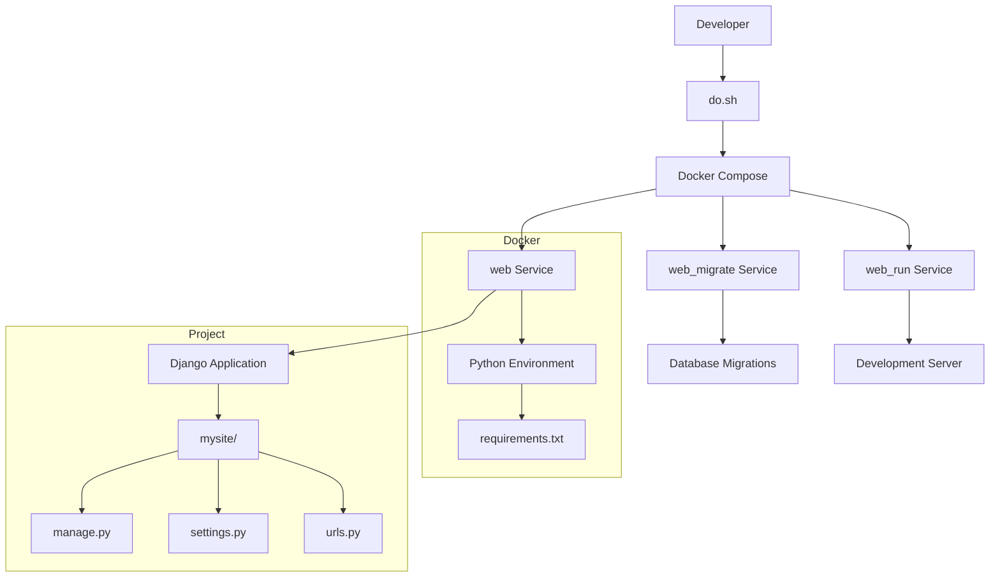

# Chapter 01 - Django Project Setup

## Purpose
This chapter sets up a basic Django project with Docker containerization. It provides:
- A development environment using Docker
- Basic project structure and configuration
- Convenience commands for common development tasks

## Architecture Overview

## Key Components

### Dockerfile
- Creates Python 3.12.3 environment
- Installs project dependencies
- Sets up working directory

### docker-compose.yml
- Defines three services:
  1. `web`: Base service with project code
  2. `web_migrate`: Runs database migrations
  3. `web_run`: Starts development server

### do.sh
Provides convenience commands:
- `build`: Build Docker images
- `start`: Start services
- `stop`: Stop services
- `shell`: Open bash in container
- `migrate`: Run database migrations
- `makemigrations`: Create new migrations
- `check`: Validate Django settings

### requirements.txt
Lists Python dependencies:
- Django 5.0.4
- asgiref 3.7.2
- sqlparse 0.5.0

## Workflow
1. Build containers: `./do.sh build`
2. Start services: `./do.sh start`
3. Access development server: http://localhost:8000
4. Run migrations: `./do.sh migrate`
5. Create migrations: `./do.sh makemigrations`
6. Open shell: `./do.sh shell`
7. Stop services: `./do.sh stop`
