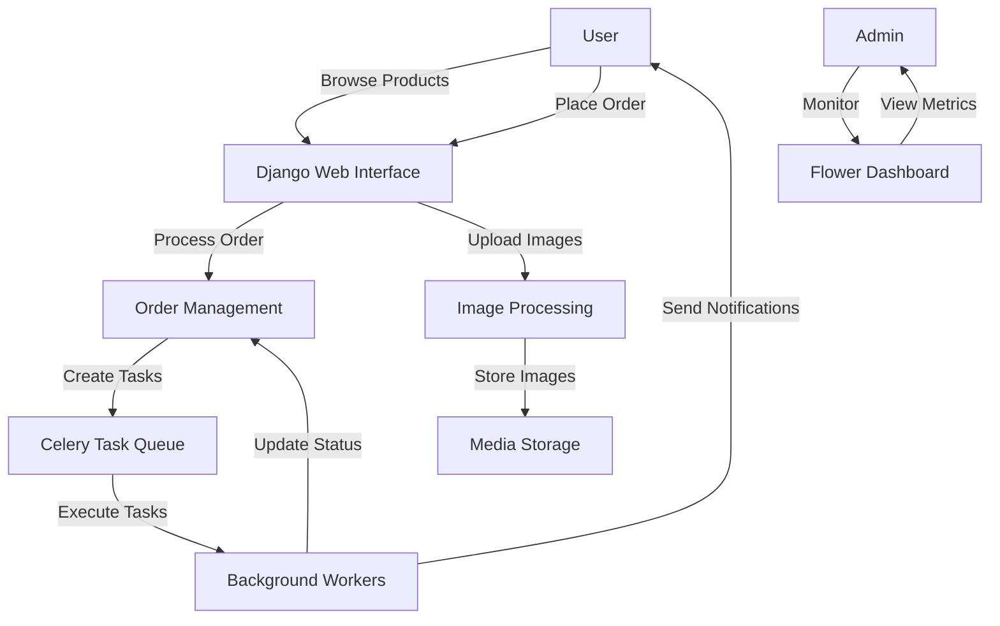

# MyShop E-commerce Platform

## Overview
MyShop is a Django-based e-commerce platform with asynchronous task processing capabilities. The system is designed to handle product management, order processing, and background tasks efficiently.

## Key Components

### Core Technologies
- **Django**: Web framework handling requests and business logic
- **Celery**: Distributed task queue for background processing
- **Flower**: Real-time monitoring for Celery tasks
- **Pillow**: Image processing for product photos

## System Flow



## Component Interactions

1. **Django Web Interface**
   - Handles user requests
   - Manages product display
   - Processes orders
   - Serves static/media files

2. **Order Management**
   - Processes payments
   - Updates inventory
   - Generates invoices
   - Creates background tasks

3. **Celery Task Queue**
   - Handles asynchronous tasks
   - Processes background jobs
   - Manages task prioritization

4. **Flower Dashboard**
   - Monitors Celery tasks
   - Provides real-time metrics
   - Offers task management interface

5. **Image Processing**
   - Handles product image uploads
   - Generates thumbnails
   - Optimizes image storage

## Development Setup

1. Build containers:
```bash
./do.sh build
```

2. Start services:
```bash
./do.sh start
```

3. Access application:
- Web Interface: http://localhost:8000
- Flower Dashboard: http://localhost:5555
