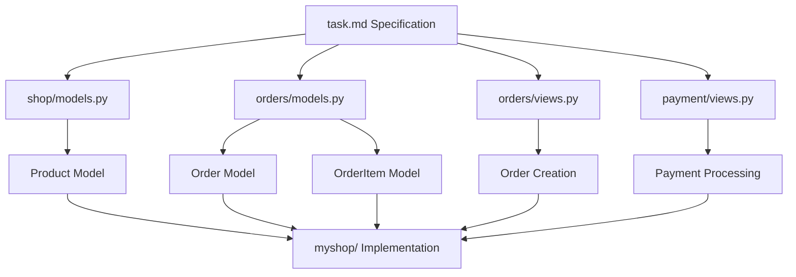

# Chapter 11 Changes

## New Features
- Added internationalization (i18n) support
- Implemented Redis caching service
- Added model translation capabilities
- Included country-specific form fields

## Dependency Updates
- Added new packages:
  - django-rosetta==0.10.0: Translation interface
  - django-parler==2.3: Model translation
  - django-localflavor==4.0: Country-specific form fields

## Infrastructure Changes
- Added Redis cache service in docker-compose
- Configured cache data persistence
- Added locale directory for translation files

## Architectural Improvements
- Implemented multi-language support
- Enhanced caching system
- Added translation management interface
- Improved form handling for international users

## Configuration Updates
- Added Redis cache configuration
- Implemented i18n settings
- Configured translation middleware
- Added language selection support

## Documentation
- Added task.md specification document that:
  - Provides background on e-commerce system
  - Specifies shipping cost calculation feature
  - Includes relevant code snippets for implementation
  - Serves as reference for developers

## Implementation Verification
- Confirmed task.md content matches myshop/ implementation:
  - Product model in shop/models.py
  - Order models in orders/models.py
  - Order creation in orders/views.py
  - Payment processing in payment/views.py

## System Flow

