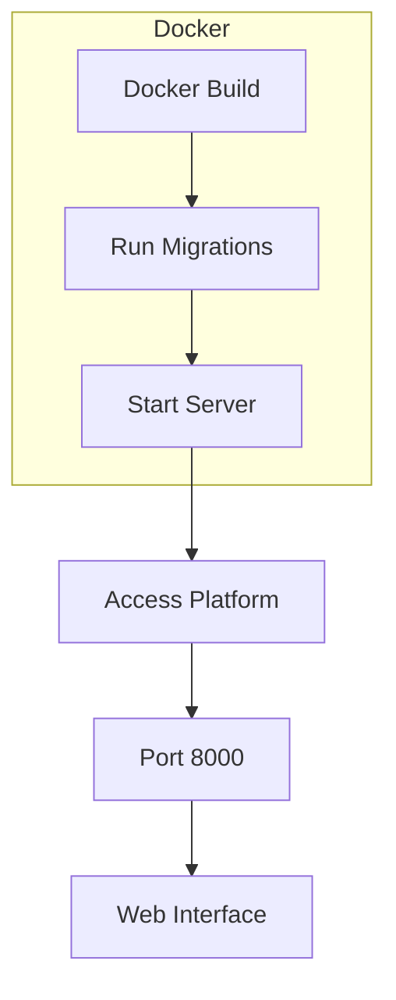

# Chapter 12 - Education Platform

## Purpose
This chapter implements an education platform using Django with:
- Docker containerization
- Database migrations
- Development server setup
- Convenient development workflow scripts

## System Flow

## Key Components

### Dockerfile
- Python 3.12 slim base image
- Installs requirements
- Sets up working directory
- Configures Python environment

### docker-compose.yml
- Defines services:
  - web: Base service
  - web_migrate: Runs migrations
  - web_run: Starts development server
- Exposes port 8000
- Ensures migrations run before server start

### do.sh
- Convenience wrapper for common tasks:
  - build: Build Docker images
  - start: Start services
  - stop: Stop services
  - shell: Open container shell
  - migrate: Run migrations
  - makemigrations: Create migrations
  - check: Validate Django settings

### requirements.txt
Core dependencies:
- Django 5.0.4
- Pillow for image processing
- ASGI and SQL utilities

## Development Workflow
1. Build containers: `./do.sh build`
2. Start services: `./do.sh start`
3. Access platform: http://localhost:8000
4. Run migrations: `./do.sh migrate`
5. Create migrations: `./do.sh makemigrations`
6. Open shell: `./do.sh shell`
7. Stop services: `./do.sh stop`
