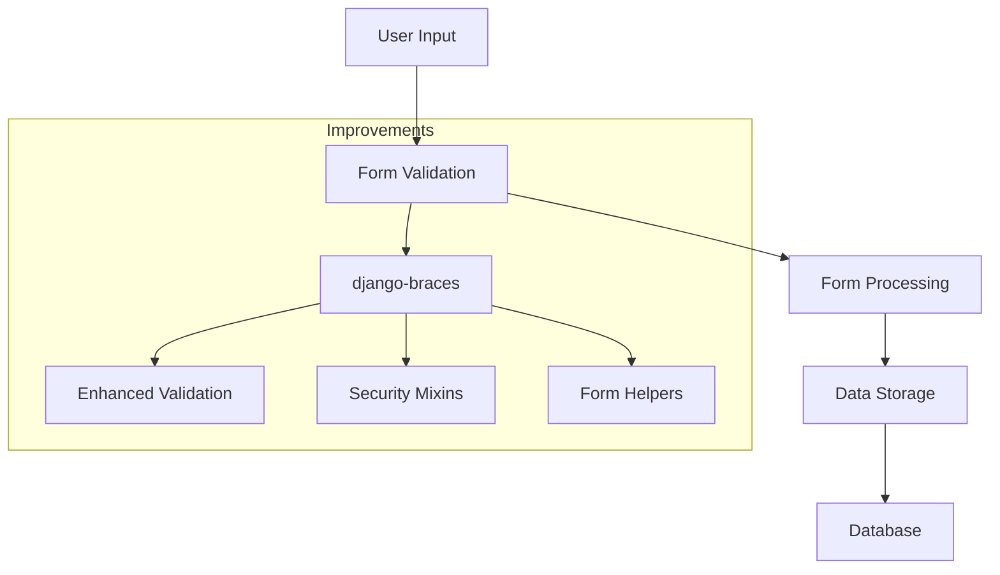

# Chapter 13 Changes

## Improvements from Chapter 12

### Added Features
- Integrated django-braces package for enhanced form handling
- Improved form validation and security
- Added support for form mixins

### System Flow

### Technical Changes
- Added django-braces==1.15.0 to requirements.txt
- Updated form handling in courses app
- Implemented form mixins for common patterns
- Added security validators for forms

## Development Workflow
1. Build containers: `./do.sh build`
2. Start services: `./do.sh start`
3. Access platform: http://localhost:8000
4. Test new form features
5. Stop services: `./do.sh stop`
