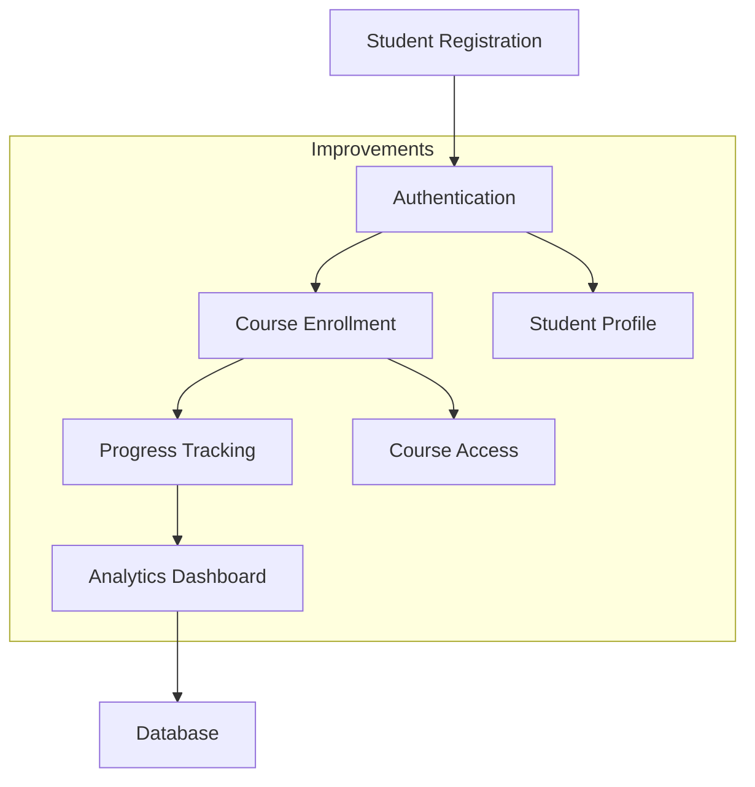

# Chapter 14 Changes

## Improvements from Chapter 13

### Added Features
- Added students app for student management
- Implemented student registration and enrollment
- Added student dashboard features
- Integrated student progress tracking

### System Flow

### Technical Changes
- Added students app with models and views
- Implemented student authentication system
- Added enrollment tracking
- Created progress monitoring features

## Development Workflow
1. Build containers: `./do.sh build`
2. Start services: `./do.sh start`
3. Access platform: http://localhost:8000
4. Test student features
5. Stop services: `./do.sh stop`
