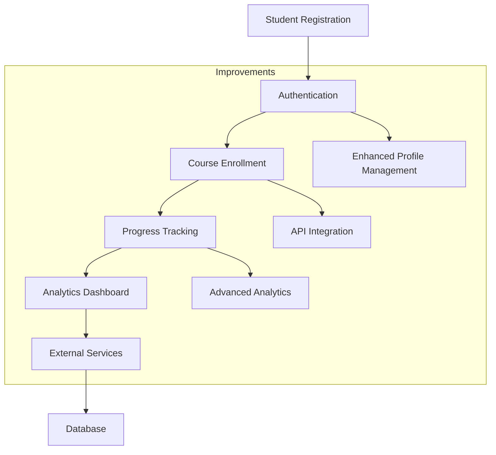

# Chapter 15 Changes

## Improvements from Chapter 14

### Added Features
- Enhanced student management system
- Improved course enrollment process
- Added advanced analytics dashboard
- Implemented API integration for external services

### System Flow

### Technical Changes
- Added API endpoints for external integrations
- Enhanced student models with additional fields
- Improved authentication system
- Added advanced analytics features

## Development Workflow
1. Build containers: `./do.sh build`
2. Start services: `./do.sh start`
3. Access platform: http://localhost:8000
4. Test API integrations
5. Stop services: `./do.sh stop`
