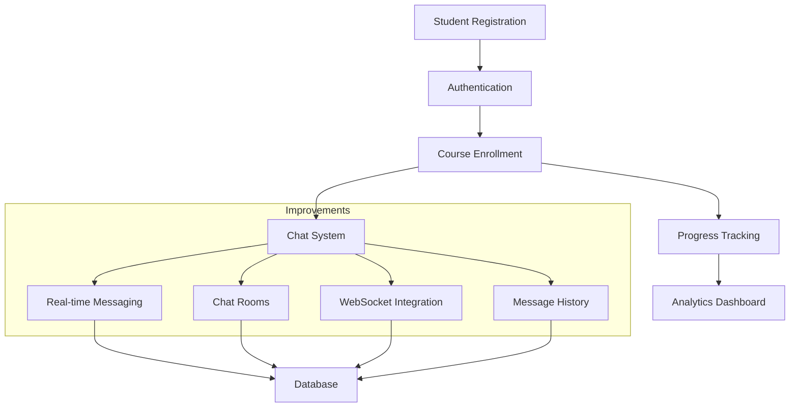

# Chapter 16 Changes

## Improvements from Chapter 15

### Added Features
- Implemented real-time chat system
- Added chat rooms for course discussions
- Integrated WebSocket support
- Added REST API endpoints for chat functionality

### System Flow

### Technical Changes
- Added channels and daphne for WebSocket support
- Implemented Redis as message broker
- Created chat models and views
- Added REST API endpoints for chat functionality
- Updated requirements with new dependencies:
  - djangorestframework
  - channels[daphne]
  - channels-redis
  - requests

## Development Workflow
1. Build containers: `./do.sh build`
2. Start services: `./do.sh start`
3. Access platform: http://localhost:8000
4. Test chat features
5. Stop services: `./do.sh stop`
