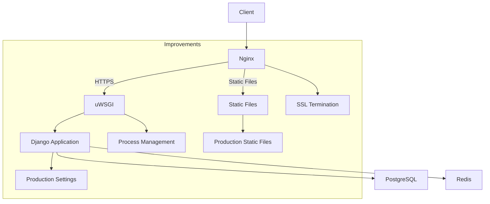

# Chapter 17 Changes

## Improvements from Chapter 16

### Added Features
- Added production deployment configuration
- Implemented HTTPS support with SSL certificates
- Added Nginx reverse proxy configuration
- Configured uWSGI application server
- Added static file handling for production
- Implemented production-ready settings configuration

### Production Architecture

### Technical Changes
- Added Nginx configuration for reverse proxy and SSL
- Implemented uWSGI for application serving
- Added production settings module
- Updated Dockerfile for production build
- Enhanced docker-compose.yml with production services
- Added new dependencies:
  - uwsgi
  - python-decouple
  - psycopg
- Created SSL certificate management
- Added static file collection and serving

## Deployment Workflow
1. Build production containers: `docker compose build`
2. Collect static files: `docker compose run web python manage.py collectstatic`
3. Start production services: `docker compose up -d`
4. Access platform: https://yourdomain.com
5. Monitor services: `docker compose logs -f`
6. Stop services: `docker compose down`
