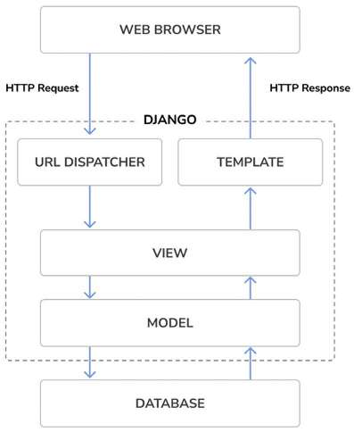

## Django web application main components

Django is a high-level Python web framework that encourages rapid development and clean, pragmatic design. It follows the Model-View-Template (MVT) architectural pattern, which is a slight variation of the Model-View-Controller (MVC) pattern. The main components of a Django web application are **Models**, **Templates**, **Views**, and **URLs**. Below is a detailed explanation of each component:

---

### 1. **Models**
Models are the backbone of a Django application. They represent the data structure and interact with the database. Django uses an Object-Relational Mapping (ORM) system, which allows you to define your database schema using Python classes instead of writing raw SQL queries.

#### Key Features:
- **Database Abstraction**: Models define tables, fields, and relationships (e.g., one-to-one, many-to-one, many-to-many).
- **Data Validation**: Models include built-in validation for fields (e.g., ensuring an email field contains a valid email address).
- **Querying**: Django's ORM provides a powerful API for querying the database (e.g., `Model.objects.filter()`).

#### Example:
```python
from django.db import models

class BlogPost(models.Model):
    title = models.CharField(max_length=200)
    content = models.TextField()
    published_date = models.DateTimeField(auto_now_add=True)

    def __str__(self):
        return self.title
```
In this example, a `BlogPost` model is defined with three fields: `title`, `content`, and `published_date`. Django will create a corresponding database table for this model.

---

### 2. **Templates**
Templates are used to generate HTML dynamically. They define the structure and layout of the web pages and allow you to inject data from your views into the HTML.

#### Key Features:
- **Template Language**: Django uses its own templating language, which includes tags, filters, and variables.
- **Reusability**: Templates can be extended and included, promoting the DRY (Don't Repeat Yourself) principle.
- **Separation of Concerns**: Templates separate the presentation layer from the business logic.

#### Example:
```html
<!-- blogpost_detail.html -->
<!DOCTYPE html>
<html>
<head>
    <title>{{ post.title }}</title>
</head>
<body>
    <h1>{{ post.title }}</h1>
    <p>{{ post.content }}</p>
    <p>Published on: {{ post.published_date }}</p>
</body>
</html>
```
In this example, the template dynamically displays the title, content, and published date of a blog post.

---

### 3. **Views**
Views are the logic layer of a Django application. They handle user requests, interact with models to fetch or manipulate data, and render templates to return a response.

#### Key Features:
- **Request Handling**: Views process HTTP requests (e.g., GET, POST) and return HTTP responses.
- **Business Logic**: Views contain the application's logic, such as processing form data or querying the database.
- **Template Rendering**: Views pass data to templates and render them into HTML.

#### Example:
```python
from django.shortcuts import render, get_object_or_404
from .models import BlogPost

def blogpost_detail(request, post_id):
    post = get_object_or_404(BlogPost, id=post_id)
    return render(request, 'blogpost_detail.html', {'post': post})
```
In this example, the `blogpost_detail` view fetches a specific blog post from the database and passes it to the `blogpost_detail.html` template.

---

### 4. **URLs**
URLs define the routing mechanism for a Django application. They map incoming HTTP requests to the appropriate views based on the URL path.

#### Key Features:
- **URL Patterns**: URLs are defined using regular expressions or simple path converters.
- **Modularity**: URLs can be organized into separate files for different parts of the application (e.g., using `include()`).
- **Named URLs**: URLs can be given names for easy reference in templates and views.

#### Example:
```python
from django.urls import path
from . import views

urlpatterns = [
    path('post/<int:post_id>/', views.blogpost_detail, name='blogpost_detail'),
]
```
In this example, a URL pattern is defined to map requests like `/post/1/` to the `blogpost_detail` view, where `1` is the `post_id`.

---

### How Components Work Together
1. A user sends an HTTP request to a specific URL (e.g., `/post/1/`).
2. Django's URL dispatcher matches the URL to a view (e.g., `blogpost_detail`).
3. The view processes the request, interacts with the model to fetch data (e.g., a blog post with `id=1`), and passes the data to a template.
4. The template renders the data into HTML and returns it as an HTTP response to the user.

---

### Summary Table
| Component   | Purpose                                                                 | Example                                                                 |
|-------------|-------------------------------------------------------------------------|-------------------------------------------------------------------------|
| **Models**  | Define the data structure and interact with the database.              | `BlogPost` model with `title`, `content`, and `published_date` fields. |
| **Templates** | Generate dynamic HTML by injecting data from views.                   | `blogpost_detail.html` displays blog post details.                     |
| **Views**   | Handle requests, process data, and render templates.                   | `blogpost_detail` view fetches a blog post and renders it.             |
| **URLs**    | Map URLs to views.                                                     | `/post/<int:post_id>/` maps to `blogpost_detail` view.                 |

By understanding and effectively using these components, you can build robust and maintainable Django web applications.

----------------------------------------------------------------------------------

## "DRY (don’t repeat yourself) principle." in Django

The **DRY (Don’t Repeat Yourself)** principle is a fundamental software development philosophy aimed at reducing redundancy and promoting code reuse. In the context of Django, adhering to the DRY principle ensures that your application is maintainable, scalable, and less prone to errors. Below is a detailed explanation of how the DRY principle is applied in Django, along with specific examples and techniques.

---

### **What is the DRY Principle?**
The DRY principle, coined by Andy Hunt and Dave Thomas in *The Pragmatic Programmer*, states:
> "Every piece of knowledge must have a single, unambiguous, authoritative representation within a system."

In simpler terms, avoid duplicating code or logic. Instead, centralize it in one place and reuse it wherever needed.

---

### **Why is DRY Important in Django?**
1. **Maintainability**: Changes need to be made in only one place, reducing the risk of inconsistencies.
2. **Readability**: Code becomes cleaner and easier to understand.
3. **Efficiency**: Less code means fewer bugs and faster development.
4. **Scalability**: Reusable components make it easier to extend the application.

---

### **How to Apply the DRY Principle in Django**

#### 1. **Reusable Models**
Models define the data structure of your application. By centralizing business logic in models, you avoid repeating the same logic in multiple views.

##### Example:
Instead of validating data in multiple views, define the validation logic in the model:
```python
from django.db import models
from django.core.exceptions import ValidationError

def validate_positive(value):
    if value < 0:
        raise ValidationError("Value must be positive.")

class Product(models.Model):
    name = models.CharField(max_length=100)
    price = models.DecimalField(max_digits=10, decimal_places=2, validators=[validate_positive])

    def save(self, *args, **kwargs):
        self.full_clean()  # Ensures validation is always run
        super().save(*args, **kwargs)
```
Now, the validation logic is centralized in the `Product` model and will be applied whenever a `Product` is saved.

---

#### 2. **Template Inheritance**
Django’s template system allows you to create reusable templates using inheritance. This avoids duplicating HTML code across multiple templates.

##### Example:
Create a base template (`base.html`) with common elements:
```html
<!DOCTYPE html>
<html>
<head>
    <title>My Site</title>
</head>
<body>
    <header>
        <h1>Welcome to My Site</h1>
    </header>
    <main>
        
    </main>
    <footer>
        <p>&copy; 2023 My Site</p>
    </footer>
</body>
</html>
```
Extend the base template in other templates:
```html


Blog Post


    <h2>{{ post.title }}</h2>
    <p>{{ post.content }}</p>

```

---

#### 3. **Class-Based Views (CBVs)**
Class-Based Views encapsulate common view logic, reducing the need to write repetitive code in function-based views.

##### Example:
Instead of writing multiple function-based views for listing and creating objects, use a `ListView` and `CreateView`:
```python
from django.views.generic import ListView, CreateView
from .models import BlogPost
from .forms import BlogPostForm

class BlogPostListView(ListView):
    model = BlogPost
    template_name = 'blogpost_list.html'
    context_object_name = 'posts'

class BlogPostCreateView(CreateView):
    model = BlogPost
    form_class = BlogPostForm
    template_name = 'blogpost_form.html'
    success_url = '/posts/'
```
CBVs provide built-in functionality for common tasks, such as pagination, form handling, and object creation.

---

#### 4. **Reusable Mixins**
Mixins are reusable classes that provide additional functionality to views or models. They help avoid duplicating code across multiple classes.

##### Example:
Create a mixin to add a `created_by` field to models:
```python
from django.db import models
from django.contrib.auth import get_user_model

User = get_user_model()

class CreatedByMixin(models.Model):
    created_by = models.ForeignKey(User, on_delete=models.CASCADE, editable=False)

    class Meta:
        abstract = True

class BlogPost(CreatedByMixin, models.Model):
    title = models.CharField(max_length=200)
    content = models.TextField()
```
Now, any model that inherits from `CreatedByMixin` will automatically include the `created_by` field.

---

#### 5. **Custom Template Tags and Filters**
If you find yourself repeating complex logic in templates, create custom template tags or filters to encapsulate that logic.

##### Example:
Create a custom filter to format dates:
```python
from django import template

register = template.Library()

@register.filter
def format_date(value):
    return value.strftime("%B %d, %Y")
```
Use the filter in templates:
```html
{{ post.published_date|format_date }}
```

---

#### 6. **Centralized URL Configuration**
Use Django’s `include()` function to organize URLs into separate files, avoiding duplication in the main `urls.py`.

##### Example:
Define app-specific URLs in `blog/urls.py`:
```python
from django.urls import path
from . import views

urlpatterns = [
    path('posts/', views.BlogPostListView.as_view(), name='blogpost_list'),
    path('posts/create/', views.BlogPostCreateView.as_view(), name='blogpost_create'),
]
```
Include the app URLs in the project’s `urls.py`:
```python
from django.urls import include, path

urlpatterns = [
    path('blog/', include('blog.urls')),
]
```

---

#### 7. **Reusable Forms**
Centralize form logic to avoid repeating validation and processing code.

##### Example:
Create a reusable form for creating and updating blog posts:
```python
from django import forms
from .models import BlogPost

class BlogPostForm(forms.ModelForm):
    class Meta:
        model = BlogPost
        fields = ['title', 'content']
```
Use the form in views:
```python
from django.shortcuts import render, redirect
from .forms import BlogPostForm

def create_blogpost(request):
    if request.method == 'POST':
        form = BlogPostForm(request.POST)
        if form.is_valid():
            form.save()
            return redirect('blogpost_list')
    else:
        form = BlogPostForm()
    return render(request, 'blogpost_form.html', {'form': form})
```

---

### **Benefits of DRY in Django**
1. **Consistency**: Changes propagate automatically across the application.
2. **Efficiency**: Less code means faster development and fewer bugs.
3. **Scalability**: Reusable components make it easier to add new features.
4. **Readability**: Clean, concise code is easier to understand and maintain.

---

### **When Not to Overdo DRY**
While DRY is a valuable principle, overusing it can lead to over-engineering. Avoid:
- Creating unnecessary abstractions.
- Making code overly complex for the sake of reusability.
- Premature optimization.

Always balance DRY with practicality and readability.

---

By applying the DRY principle in Django, you can build efficient, maintainable, and scalable web applications.

----------------------------------------------------------------------------------

## The Django architecture



When you start adding a new feature or updating an existing feature in a Django web application, it’s essential to understand the flow of interactions between the components and how Django processes requests and responses. Below is a detailed explanation of the Django thinking flow, including the interactions between the **web browser**, **HTTP requests/responses**, **templates**, and other Django components.

---

### **Django Thinking Flow**

#### 1. **User Interaction in the Web Browser**
   - The process begins when a user interacts with the web application in their browser (e.g., clicking a link, submitting a form).
   - The browser sends an **HTTP request** to the server based on the user’s action.

---

#### 2. **HTTP Request**
   - The HTTP request contains information such as:
     - **URL**: The path the user is trying to access (e.g., `/posts/1/`).
     - **Method**: The type of request (e.g., `GET`, `POST`, `PUT`, `DELETE`).
     - **Headers**: Metadata about the request (e.g., cookies, content type).
     - **Body**: Data sent with the request (e.g., form data for a `POST` request).

---

#### 3. **Django URL Dispatcher**
   - Django’s **URL dispatcher** receives the HTTP request and matches the URL to a specific **view** based on the URL patterns defined in `urls.py`.
   - Example URL configuration:
     ```python
     from django.urls import path
     from . import views

     urlpatterns = [
         path('posts/<int:post_id>/', views.blogpost_detail, name='blogpost_detail'),
     ]
     ```
   - In this example, a request to `/posts/1/` would be routed to the `blogpost_detail` view.

---

#### 4. **View Processing**
   - The **view** is responsible for processing the request. It performs the following tasks:
     - **Fetching Data**: Interacts with the **models** to retrieve or manipulate data from the database.
     - **Business Logic**: Implements the application’s logic (e.g., validating form data, handling user authentication).
     - **Rendering Templates**: Passes data to a **template** and renders it into HTML.
   - Example view:
     ```python
     from django.shortcuts import render, get_object_or_404
     from .models import BlogPost

     def blogpost_detail(request, post_id):
         post = get_object_or_404(BlogPost, id=post_id)
         return render(request, 'blogpost_detail.html', {'post': post})
     ```
   - In this example, the view fetches a `BlogPost` object and passes it to the `blogpost_detail.html` template.

---

#### 5. **Template Rendering**
   - The **template** is an HTML file with placeholders for dynamic data. Django’s template engine replaces these placeholders with actual data from the view.
   - Example template (`blogpost_detail.html`):
     ```html
     <!DOCTYPE html>
     <html>
     <head>
         <title>{{ post.title }}</title>
     </head>
     <body>
         <h1>{{ post.title }}</h1>
         <p>{{ post.content }}</p>
     </body>
     </html>
     ```
   - The template is rendered into a complete HTML page, which is sent back to the browser as an **HTTP response**.

---

#### 6. **HTTP Response**
   - The **HTTP response** contains:
     - **Status Code**: Indicates the result of the request (e.g., `200 OK`, `404 Not Found`).
     - **Headers**: Metadata about the response (e.g., content type, cookies).
     - **Body**: The rendered HTML content.
   - The browser receives the response and displays the page to the user.

---

### **Interactions Between Components**
When adding or updating a feature, you’ll interact with the following components:

#### 1. **Models**
   - Define the data structure and database schema.
   - Add or update fields, methods, or validations.
   - Example: Adding a `category` field to a `BlogPost` model:
     ```python
     class BlogPost(models.Model):
         title = models.CharField(max_length=200)
         content = models.TextField()
         category = models.CharField(max_length=100)
     ```

#### 2. **Views**
   - Implement the logic for handling requests.
   - Add or update views to support new features.
   - Example: Creating a view to list blog posts by category:
     ```python
     def blogpost_list_by_category(request, category):
         posts = BlogPost.objects.filter(category=category)
         return render(request, 'blogpost_list.html', {'posts': posts})
     ```

#### 3. **Templates**
   - Define the HTML structure and layout.
   - Add or update templates to display new data or features.
   - Example: Updating a template to show the `category` field:
     ```html
     <h2>{{ post.title }}</h2>
     <p>Category: {{ post.category }}</p>
     <p>{{ post.content }}</p>
     ```

#### 4. **URLs**
   - Map URLs to views.
   - Add or update URL patterns for new features.
   - Example: Adding a URL pattern for the category-based list view:
     ```python
     path('posts/category/<str:category>/', views.blogpost_list_by_category, name='blogpost_list_by_category'),
     ```

---

### **Django Thinking Flow for Adding/Updating Features**
1. **Identify the Feature**: Determine what the new feature or update should do.
2. **Update Models**: Modify or create models to support the feature.
3. **Create/Update Views**: Implement the logic for handling requests related to the feature.
4. **Design Templates**: Create or update templates to display the feature.
5. **Configure URLs**: Add or update URL patterns to route requests to the new views.
6. **Test**: Test the feature to ensure it works as expected.
7. **Deploy**: Deploy the updated application to the server.

---

### **Example: Adding a Comment Feature**
1. **Model**: Add a `Comment` model.
   ```python
   class Comment(models.Model):
       post = models.ForeignKey(BlogPost, on_delete=models.CASCADE)
       author = models.CharField(max_length=100)
       content = models.TextField()
       created_at = models.DateTimeField(auto_now_add=True)
   ```
2. **View**: Create a view to handle comment submissions.
   ```python
   def add_comment(request, post_id):
       post = get_object_or_404(BlogPost, id=post_id)
       if request.method == 'POST':
           author = request.POST.get('author')
           content = request.POST.get('content')
           Comment.objects.create(post=post, author=author, content=content)
           return redirect('blogpost_detail', post_id=post_id)
       return render(request, 'add_comment.html', {'post': post})
   ```
3. **Template**: Create a template for the comment form.
   ```html
   <form method="post">
       
       <input type="text" name="author" placeholder="Your name">
       <textarea name="content" placeholder="Your comment"></textarea>
       <button type="submit">Submit</button>
   </form>
   ```
4. **URL**: Add a URL pattern for the comment view.
   ```python
   path('posts/<int:post_id>/comment/', views.add_comment, name='add_comment'),
   ```

---

----------------------------------------------------------------------------------

## New features in Django 5

Django 5 introduces several significant new features and improvements that enhance the framework's functionality and developer experience. Below is a detailed explanation of the key features and changes in Django 5:

---

### **1. Facet Filters in the Administration Site**
   - **What it is**: Facet filters allow you to display counts for applied filters in the Django admin interface. This helps users understand how many items match each filter.
   - **How it works**: When filters are applied to the admin object list, facet counts are displayed alongside each filter option.
   - **Use case**: This feature is particularly useful for large datasets, as it provides immediate feedback on the number of items matching each filter.
   - **Example**:
     ```python
     class BookAdmin(admin.ModelAdmin):
         list_filter = ('author', 'genre')
     ```
     In the admin interface, if you filter by `author`, you’ll see counts for each `genre` within the filtered results.

---

### **2. Simplified Templates for Form Field Rendering**
   - **What it is**: Django 5 simplifies the process of rendering form fields by allowing you to define field groups with associated templates.
   - **How it works**: You can group related elements of a form field (e.g., label, widget, help text, errors) and render them using a single template.
   - **Use case**: This makes it easier to customize the appearance of form fields without duplicating code.
   - **Example**:
     ```html
     
         <div class="field-group">
             {{ field.label_tag }}
             {{ field }}
             {{ field.help_text }}
             {{ field.errors }}
         </div>
     
     ```

---

### **3. Database-Computed Default Values**
   - **What it is**: Django 5 allows you to define default values for model fields that are computed by the database.
   - **How it works**: Instead of setting default values in Python, you can use database functions to compute default values at the database level.
   - **Use case**: This is useful for fields that require dynamic default values based on database logic.
   - **Example**:
     ```python
     from django.db import models
     from django.db.models.functions import Now

     class Event(models.Model):
         name = models.CharField(max_length=100)
         created_at = models.DateTimeField(db_default=Now())
     ```

---

### **4. Database-Generated Model Fields**
   - **What it is**: Django 5 introduces database-generated fields, where the field value is automatically set by the database using an expression.
   - **How it works**: The field value is computed using the `GENERATED ALWAYS` SQL syntax, which ensures the value is updated whenever the model changes.
   - **Use case**: This is useful for fields that depend on other fields or require complex calculations.
   - **Example**:
     ```python
     from django.db import models

     class Product(models.Model):
         price = models.DecimalField(max_digits=10, decimal_places=2)
         tax = models.DecimalField(max_digits=10, decimal_places=2, generated=True, expression='price * 0.2')
     ```

---

### **5. More Options for Declaring Model Field Choices**
   - **What it is**: Django 5 provides more flexibility in declaring choices for model fields.
   - **How it works**: You can now use a mapping or callable directly, instead of requiring the `.choices` attribute.
   - **Use case**: This simplifies the process of defining and using choices in model fields.
   - **Example**:
     ```python
     from django.db import models

     class Book(models.Model):
         STATUS_CHOICES = {
             'draft': 'Draft',
             'published': 'Published',
         }
         status = models.CharField(max_length=10, choices=STATUS_CHOICES)
     ```

---

### **6. Asynchronous Support Improvements**
   - **What it is**: Django 5 enhances its asynchronous capabilities, building on the ASGI support introduced in Django 3 and improved in Django 4.1.
   - **Key Improvements**:
     - **Asynchronous Authentication**: Adds asynchronous functions to the authentication framework.
     - **Asynchronous Signal Dispatching**: Supports asynchronous signal handlers.
     - **Asynchronous Decorators**: Adds asynchronous support to multiple built-in decorators.
   - **Use case**: These improvements make Django more suitable for real-time applications and improve performance for I/O-bound tasks.
   - **Example**:
     ```python
     from django.http import JsonResponse
     from django.views import View

     class AsyncView(View):
         async def get(self, request, *args, **kwargs):
             return JsonResponse({'message': 'Hello, async world!'})
     ```

---

### **7. Dropped Support for Python 3.8 and 3.9**
   - **What it is**: Django 5 no longer supports Python 3.8 and 3.9.
   - **Implications**: You must upgrade to Python 3.10 or later to use Django 5.
   - **Action**: Ensure your environment is running a supported Python version before upgrading to Django 5.

---

### **Summary of New Features in Django 5**
| Feature                              | Description                                                                 | Example Use Case                          |
|--------------------------------------|-----------------------------------------------------------------------------|-------------------------------------------|
| **Facet Filters in Admin**           | Displays counts for applied filters in the admin interface.                 | Filtering large datasets in the admin.    |
| **Simplified Form Field Rendering**  | Streamlines rendering of form fields with templates.                        | Customizing form appearance.              |
| **Database-Computed Default Values** | Allows default values to be computed by the database.                       | Dynamic default values based on DB logic. |
| **Database-Generated Model Fields**  | Automatically sets field values using database expressions.                 | Fields dependent on other fields.         |
| **More Options for Field Choices**   | Provides flexibility in declaring choices for model fields.                 | Simplifying choice definitions.           |
| **Asynchronous Support Improvements**| Enhances async capabilities in authentication, signals, and decorators.     | Real-time applications and I/O tasks.     |
| **Dropped Python 3.8 and 3.9**       | Requires Python 3.10 or later.                                              | Ensuring compatibility with Django 5.     |

---

### **How to Use These Features in Your Project**
1. **Upgrade to Django 5**: Ensure your project is compatible with Django 5 and upgrade using `pip install django==5.0`.
2. **Update Your Code**: Refactor your code to take advantage of new features, such as simplified form rendering or database-computed defaults.
3. **Test Thoroughly**: Test your application to ensure compatibility and functionality with the new features.
4. **Deploy**: Deploy the updated application to your production environment.

By leveraging these new features, you can build more efficient, maintainable, and scalable Django applications.


----------------------------------------------------------------------------------

## The term "Middleware"

You're correct that both Django and Scrapy use the term **"Middleware"**, and they are indeed related to a common design pattern in web-related libraries. However, they serve different purposes and operate in different contexts. Below is a detailed comparison table followed by answers to your other questions.

---

### **Comparison Table: Django Middleware vs. Scrapy Middleware**

| **Aspect**               | **Django Middleware**                                                                 | **Scrapy Middleware**                                                                 |
|--------------------------|--------------------------------------------------------------------------------------|--------------------------------------------------------------------------------------|
| **Purpose**              | Handles HTTP requests and responses globally in a Django web application.            | Processes requests, responses, and items in a Scrapy web scraping framework.         |
| **Context**              | Web framework for building web applications.                                         | Web scraping framework for extracting data from websites.                            |
| **Execution Order**      | Executed in the order defined in `MIDDLEWARE` settings for requests and responses.   | Executed in the order defined in `DOWNLOADER_MIDDLEWARES` or `SPIDER_MIDDLEWARES`.   |
| **Types**                | Single type of middleware for requests and responses.                                | Two types: **Downloader Middleware** and **Spider Middleware**.                      |
| **Key Methods**          | `process_request`, `process_response`, `process_view`, `process_exception`.          | `process_request`, `process_response`, `process_item`, `process_spider_input/output`.|
| **Use Cases**            | Authentication, logging, CSRF protection, caching, etc.                             | Request modification, response filtering, error handling, item processing, etc.      |
| **Configuration**        | Defined in `settings.py` under `MIDDLEWARE`.                                         | Defined in `settings.py` under `DOWNLOADER_MIDDLEWARES` or `SPIDER_MIDDLEWARES`.     |
| **Example**              | Adding a custom header to all responses.                                             | Rotating user agents or handling retries for failed requests.                        |

---

### **Key Differences**
1. **Context**:
   - **Django Middleware**: Used in a web application framework to handle HTTP requests and responses.
   - **Scrapy Middleware**: Used in a web scraping framework to process requests, responses, and extracted data.

2. **Types**:
   - **Django Middleware**: Single type that processes both requests and responses.
   - **Scrapy Middleware**: Two types—**Downloader Middleware** (for requests/responses) and **Spider Middleware** (for items and spider input/output).

3. **Use Cases**:
   - **Django Middleware**: Focuses on web application concerns like authentication, logging, and security.
   - **Scrapy Middleware**: Focuses on web scraping concerns like request modification, response filtering, and error handling.

---

### **Common Design Pattern**
Both Django and Scrapy middleware systems are based on the **Middleware Design Pattern**, which allows you to add functionality to a pipeline without modifying the core logic. This pattern is widely used in web-related libraries because it provides a flexible and modular way to handle cross-cutting concerns.

---

### **Other Questions**

#### 1. **What is the Middleware Design Pattern?**
   - The Middleware Design Pattern is a structural pattern that allows you to add functionality to a pipeline by chaining multiple components (middleware) together.
   - Each middleware component processes the input, performs some action, and passes the output to the next component in the chain.
   - This pattern is commonly used in web frameworks and libraries to handle cross-cutting concerns like logging, authentication, and error handling.

#### 2. **Why is Middleware Important in Web Frameworks?**
   - **Modularity**: Middleware allows you to separate concerns and add functionality in a modular way.
   - **Reusability**: Middleware components can be reused across different parts of the application.
   - **Flexibility**: You can easily add, remove, or reorder middleware components without modifying the core logic.
   - **Cross-Cutting Concerns**: Middleware is ideal for handling tasks that apply globally, such as authentication, logging, and error handling.

#### 3. **Can Middleware Be Used in Other Contexts Besides Web Frameworks?**
   - Yes, the Middleware Design Pattern can be applied in other contexts, such as:
     - **Message Brokers**: Middleware can process messages in a messaging system.
     - **Data Pipelines**: Middleware can transform or filter data in a data processing pipeline.
     - **Game Development**: Middleware can handle tasks like input processing or rendering in a game engine.

#### 4. **How Do I Write Custom Middleware in Django and Scrapy?**
   - **Django**:
     ```python
     class CustomMiddleware:
         def __init__(self, get_response):
             self.get_response = get_response

         def __call__(self, request):
             # Process request
             response = self.get_response(request)
             # Process response
             return response
     ```
     Add it to `MIDDLEWARE` in `settings.py`.

   - **Scrapy (Downloader Middleware)**:
     ```python
     class CustomDownloaderMiddleware:
         def process_request(self, request, spider):
             # Modify request
             return None

         def process_response(self, request, response, spider):
             # Modify response
             return response
     ```
     Add it to `DOWNLOADER_MIDDLEWARES` in `settings.py`.

---

### **Conclusion**
While Django and Scrapy middleware systems are based on the same design pattern, they serve different purposes and operate in different contexts. Django middleware focuses on handling HTTP requests and responses in a web application, while Scrapy middleware focuses on processing requests, responses, and items in a web scraping framework. Understanding these differences will help you use middleware effectively in both frameworks.

----------------------------------------------------------------------------------

## Is learning backend or frontend still necessary?

The rise of AI and Large Language Models (LLMs) has indeed revolutionized the way we approach web development. Tools like ChatGPT, GitHub Copilot, and others can generate code, design layouts, and even deploy full-stack applications in a fraction of the time it would take a human developer. However, this doesn’t render learning backend or frontend development obsolete. Here’s why:

---

### **1. Understanding the Fundamentals**
   - **Why it’s important**: AI can generate code, but it can’t teach you the underlying principles of how things work. Understanding backend and frontend fundamentals (e.g., HTTP, databases, APIs, DOM manipulation) is crucial for debugging, optimizing, and extending AI-generated code.
   - **Example**: If an AI-generated application has a performance issue, you’ll need to understand how databases or rendering works to fix it.

---

### **2. Customization and Flexibility**
   - **Why it’s important**: AI tools often produce generic solutions. For unique or complex requirements, you’ll need to customize the code, which requires a deep understanding of backend and frontend development.
   - **Example**: If you need to integrate a custom payment gateway or implement a specific user interface design, AI might not provide the exact solution you need.

---

### **3. Debugging and Troubleshooting**
   - **Why it’s important**: AI-generated code isn’t perfect. It can contain bugs, security vulnerabilities, or inefficiencies. Knowing how to debug and troubleshoot is essential for maintaining a functional application.
   - **Example**: If an AI-generated API endpoint fails, you’ll need to understand backend logic to identify and fix the issue.

---

### **4. Security**
   - **Why it’s important**: Security is a critical aspect of web development. AI tools may not always follow best practices for securing applications. Understanding backend and frontend security (e.g., authentication, authorization, input validation) is vital for protecting user data.
   - **Example**: If an AI-generated form doesn’t sanitize user input, you’ll need to know how to prevent SQL injection or XSS attacks.

---

### **5. Performance Optimization**
   - **Why it’s important**: AI-generated code may not be optimized for performance. Understanding backend (e.g., database indexing, caching) and frontend (e.g., lazy loading, minimizing render cycles) techniques is necessary for building fast, responsive applications.
   - **Example**: If an AI-generated page loads slowly, you’ll need to optimize the code or database queries.

---

### **6. Collaboration and Communication**
   - **Why it’s important**: In a team environment, you’ll need to collaborate with other developers, designers, and stakeholders. Understanding backend and frontend development helps you communicate effectively and contribute meaningfully to the project.
   - **Example**: If you’re working with a frontend developer, knowing how APIs work will help you design a better backend.

---

### **7. Staying Relevant in the Industry**
   - **Why it’s important**: The tech industry evolves rapidly. While AI can automate certain tasks, developers who understand both backend and frontend development are better equipped to adapt to new technologies and frameworks.
   - **Example**: If a new frontend framework like React or a backend tool like GraphQL becomes popular, you’ll need to learn it to stay competitive.

---

### **8. Creativity and Problem-Solving**
   - **Why it’s important**: AI tools follow patterns and existing examples. For innovative solutions or unique problems, human creativity and problem-solving skills are irreplaceable.
   - **Example**: If you’re building a novel feature that doesn’t have existing examples, you’ll need to design and implement it yourself.

---

### **9. Ownership and Control**
   - **Why it’s important**: Relying solely on AI means you’re dependent on its capabilities and limitations. Understanding backend and frontend development gives you full ownership and control over your application.
   - **Example**: If an AI tool stops supporting a specific feature, you’ll need to implement it yourself.

---

### **10. Learning AI Tools Themselves**
   - **Why it’s important**: To effectively use AI tools, you need to understand the context in which they operate. Knowledge of backend and frontend development helps you guide AI tools to produce better results.
   - **Example**: If you’re using an AI to generate a React component, understanding React’s lifecycle methods will help you refine the output.

---

### **Conclusion**
While AI and LLMs can significantly speed up development and reduce the need for repetitive coding tasks, they are not a substitute for learning backend and frontend development. Instead, they are tools that complement your skills. Here’s how to approach it:

1. **Learn the Basics**: Master the fundamentals of backend and frontend development.
2. **Use AI as a Tool**: Leverage AI to automate repetitive tasks, generate boilerplate code, or explore new ideas.
3. **Focus on Higher-Level Skills**: Develop skills in problem-solving, architecture, security, and optimization.
4. **Stay Updated**: Keep learning about new technologies, frameworks, and AI advancements.

By combining your development expertise with AI tools, you can build better, faster, and more innovative applications.

----------------------------------------------------------------------------------

## Detailed guidance when using Django

### **1. Best Practices for Creating Blog Data Models**
When designing data models for a blog, follow these best practices:

#### Key Considerations:
- **Normalization**: Avoid redundancy by splitting data into logical tables (e.g., separate tables for posts, comments, and authors).
- **Relationships**: Use appropriate relationships (`ForeignKey`, `OneToOneField`, `ManyToManyField`) to connect models.
- **Field Types**: Choose the right field types (e.g., `CharField`, `TextField`, `DateTimeField`) for your data.
- **Meta Options**: Use `Meta` class to define ordering, verbose names, and database table names.
- **Methods**: Add methods to models for custom logic (e.g., `__str__`, `get_absolute_url`).

#### Example Blog Models:
```python
from django.db import models
from django.urls import reverse
from django.contrib.auth.models import User

class Category(models.Model):
    name = models.CharField(max_length=100)

    def __str__(self):
        return self.name

class Post(models.Model):
    title = models.CharField(max_length=200)
    content = models.TextField()
    author = models.ForeignKey(User, on_delete=models.CASCADE)
    category = models.ForeignKey(Category, on_delete=models.SET_NULL, null=True)
    published_date = models.DateTimeField(auto_now_add=True)
    updated_date = models.DateTimeField(auto_now=True)

    def __str__(self):
        return self.title

    def get_absolute_url(self):
        return reverse('post_detail', args=[str(self.id)])

class Comment(models.Model):
    post = models.ForeignKey(Post, on_delete=models.CASCADE, related_name='comments')
    author = models.CharField(max_length=100)
    content = models.TextField()
    created_date = models.DateTimeField(auto_now_add=True)

    def __str__(self):
        return f"Comment by {self.author} on {self.post.title}"
```

---

### **2. Tips and Tricks for Working with QuerySets and Custom Managers**
QuerySets and custom managers are powerful tools for interacting with your database.

#### QuerySet Tips:
- **Chaining**: Chain multiple QuerySet methods (e.g., `filter()`, `exclude()`, `order_by()`).
- **Lazy Evaluation**: QuerySets are lazy; they only hit the database when evaluated (e.g., when iterated or printed).
- **Aggregation**: Use `annotate()` and `aggregate()` for complex queries.
- **Optimization**: Use `select_related()` and `prefetch_related()` to reduce database queries.

#### Custom Managers:
- **Purpose**: Add custom QuerySet methods or override default behavior.
- **Example**:
```python
class PublishedManager(models.Manager):
    def get_queryset(self):
        return super().get_queryset().filter(status='published')

class Post(models.Model):
    STATUS_CHOICES = [
        ('draft', 'Draft'),
        ('published', 'Published'),
    ]
    status = models.CharField(max_length=10, choices=STATUS_CHOICES, default='draft')
    objects = models.Manager()  # Default manager
    published = PublishedManager()  # Custom manager
```

---

### **3. Steps to Build Blog Post List and Detail Views**
#### List View:
```python
from django.views.generic import ListView
from .models import Post

class PostListView(ListView):
    model = Post
    template_name = 'post_list.html'
    context_object_name = 'posts'
    paginate_by = 10
```

#### Detail View:
```python
from django.views.generic import DetailView
from .models import Post

class PostDetailView(DetailView):
    model = Post
    template_name = 'post_detail.html'
    context_object_name = 'post'
```

#### URL Configuration:
```python
from django.urls import path
from .views import PostListView, PostDetailView

urlpatterns = [
    path('', PostListView.as_view(), name='post_list'),
    path('post/<int:pk>/', PostDetailView.as_view(), name='post_detail'),
]
```

---

### **4. Guidelines for Creating Templates for the Views**
#### Template Structure:
- **Base Template**: Create a `base.html` for common elements (e.g., header, footer).
- **Inheritance**: Use `` to inherit from the base template.
- **Blocks**: Define `` sections for dynamic content.

#### Example Templates:
```html
<!-- base.html -->
<!DOCTYPE html>
<html>
<head>
    <title>My Blog</title>
</head>
<body>
    <header>
        <h1>My Blog</h1>
    </header>
    <main>
        
    </main>
    <footer>
        <p>&copy; 2023 My Blog</p>
    </footer>
</body>
</html>

<!-- post_list.html -->



    
        <h2><a href="{{ post.get_absolute_url }}">{{ post.title }}</a></h2>
        <p>{{ post.content|truncatewords:30 }}</p>
    


<!-- post_detail.html -->



    <h1>{{ post.title }}</h1>
    <p>{{ post.content }}</p>
    <h2>Comments</h2>
    
        <p>{{ comment.author }}: {{ comment.content }}</p>
    

```

---

### **5. Comprehensive Explanation of the Request/Response Cycle in Django**
1. **Request**: The user sends an HTTP request to the server.
2. **URL Dispatcher**: Django matches the URL to a view using `urls.py`.
3. **View**: The view processes the request, interacts with models, and renders a template.
4. **Response**: The view returns an HTTP response (e.g., HTML, JSON) to the user.
5. **Template Rendering**: If a template is used, Django replaces placeholders with data and renders the final HTML.

---

### **6. Detailed Instructions and Examples for Writing and Using Django Management Commands**
#### Create a Custom Command:
1. **Directory Structure**:
   ```
   myapp/
       management/
           commands/
               __init__.py
               my_custom_command.py
   ```
2. **Command Code**:
```python
from django.core.management.base import BaseCommand
from myapp.models import Post

class Command(BaseCommand):
    help = 'Publishes all draft posts'

    def handle(self, *args, **kwargs):
        posts = Post.objects.filter(status='draft')
        for post in posts:
            post.status = 'published'
            post.save()
        self.stdout.write(self.style.SUCCESS('Successfully published all draft posts'))
```

#### Run the Command:
```bash
python manage.py my_custom_command
```

----------------------------------------------------------------------------------


----------------------------------------------------------------------------------


----------------------------------------------------------------------------------


----------------------------------------------------------------------------------


----------------------------------------------------------------------------------

## Additional resources

Django’s design philosophies: https://docs.djangoproject.com/en/5.0/misc/design-

Django model field reference: https://docs.djangoproject.com/en/5.0/ref/models/fields/

Model index reference: https://docs.djangoproject.com/en/5.0/ref/models/indexes/

Python support for enumerations: https://docs.python.org/3/library/enum.html/philosophies/

Django model enumeration types: https://docs.djangoproject.com/en/5.0/ref/models/fields/#enumeration-types

Django settings reference: https://docs.djangoproject.com/en/5.0/ref/settings/

Database default values for model fields: https://docs.djangoproject.com/en/5.0/ref/models/fields/#django.db.models.Field.db_default

Database functions: https://docs.djangoproject.com/en/5.0/ref/models/database-functions/

Django administration site: https://docs.djangoproject.com/en/5.0/ref/contrib/admin/

Model API reference: https://docs.djangoproject.com/en/5.0/ref/models/

Making queries with the Django ORM: https://docs.djangoproject.com/en/5.0/topics/db/queries/

QuerySet API reference: https://docs.djangoproject.com/en/5.0/ref/models/querysets/

Complex lookups with Q objects: https://docs.djangoproject.com/en/5.0/topics/db/queries/#complex-lookups-with-q-objects

Django URL dispatcher: https://docs.djangoproject.com/en/5.0/topics/http/urls/

Django template language: https://docs.djangoproject.com/en/5.0/ref/templates/language/

Built-in template tags and filters: https://docs.djangoproject.com/en/5.0/ref/templates/builtins/

Django management commands: https://docs.djangoproject.com/en/5.0/ref/django-admin/

----------------------------------------------------------------------------------
